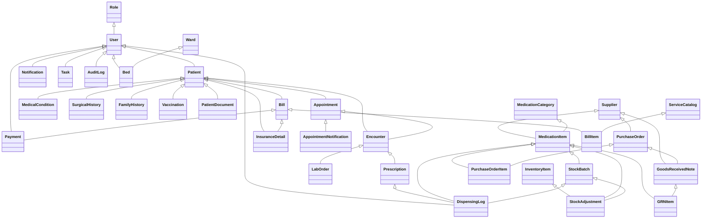

# Chelal Hospital Management System Backend

## Summary

Chelal HMS is a comprehensive Django REST backend for hospital management, including:
- Patient registration, appointments, encounters, prescriptions
- Pharmacy inventory, procurement, dispensing, and reporting
- Billing, insurance, payments
- Bed/ward management
- Audit logs, notifications, dashboards
- Appointment reminders/follow-ups (SMS & email)
- Role-based access, 2FA, and more

---

## Features

- Advanced pharmacy inventory (batch, FEFO, supplier, reporting)
- Billing & insurance (service catalog, bills, payments, insurance)
- Role-specific dashboards
- Audit logs, session management, 2FA
- Bed/ward management
- Appointment reminders & follow-ups (SMS/Email)
- Telemedicine-ready (WebSocket, video-ready)
- Feedback endpoints
- Full admin and API documentation

---

## Data Model (All Models)

See the Mermaid class diagram below for relationships. All models are in `core/models.py`.

### Main Models

- **Role**: User roles (Doctor, Receptionist, Admin, etc.)
- **User**: Custom user with role
- **Patient**: Patient demographics and info
- **Appointment**: Scheduling, status, patient, doctor
- **Encounter**: Clinical encounter, notes, diagnosis
- **Prescription**: Linked to encounter, medication, dosage
- **InventoryItem**: Simple inventory (legacy)
- **Vitals**: Vitals for an encounter
- **MedicalCondition**: Patient chronic conditions
- **SurgicalHistory**: Patient surgical history
- **FamilyHistory**: Family medical history
- **Vaccination**: Vaccination records
- **LabOrder**: Lab test orders/results
- **PatientDocument**: Uploaded files for patient
- **Notification**: User notifications
- **NoteTemplate**: Note templates for clinicians
- **Task**: Tasks for users
- **AuditLog**: Security and audit trail
- **Ward**: Hospital wards
- **Bed**: Beds in wards
- **Supplier**: Pharmacy supplier
- **MedicationCategory**: Pharmacy medication category
- **MedicationItem**: Pharmacy medication master
- **StockBatch**: Pharmacy batch tracking
- **PurchaseOrder**: Pharmacy procurement
- **PurchaseOrderItem**: Items in a purchase order
- **GoodsReceivedNote**: Goods received from supplier
- **GRNItem**: Items in a GRN
- **DispensingLog**: Medication dispensing
- **StockAdjustment**: Inventory adjustments
- **ServiceCatalog**: Billable services
- **InsuranceDetail**: Patient insurance
- **Bill**: Patient bill
- **BillItem**: Line items in a bill
- **Payment**: Payments for bills
- **AppointmentNotification**: Reminders/follow-ups (SMS/email)

---

## Class Diagram



---

## Use Case Diagram (Textual)

- **Receptionist**: Register patient, schedule appointment, manage queue, assign beds
- **Doctor**: View dashboard, see appointments, record encounter, prescribe, order labs
- **Pharmacist**: Manage inventory, dispense, receive stock, report
- **Admin**: Manage users, audit logs, sessions, dashboards, all data
- **Patient**: Receive reminders, follow-ups, feedback

---

## Sequence Diagram: Appointment Reminder (SMS/Email)


---

## API Endpoints & Usage Examples

### Authentication
- `POST /api/auth/` — Obtain JWT token
- `POST /api/auth/refresh/` — Refresh JWT token

### Patients
- `GET /api/patients/` — List patients
- `POST /api/patients/` — Create patient
- `GET /api/patients/{id}/` — Retrieve patient
- `PUT/PATCH /api/patients/{id}/` — Update patient
- `DELETE /api/patients/{id}/` — Delete patient

#### Example: Create a Patient
```http
POST /api/patients/
{
  "unique_id": "P12345",
  "first_name": "Jane",
  "last_name": "Doe",
  "date_of_birth": "1990-01-01",
  "gender": "Female",
  "contact_info": "+2207834351",
  "address": "Banjul",
  "known_allergies": "Penicillin"
}
```

### Appointments
- `GET /api/appointments/` — List appointments (filter by patient, doctor, date)
- `POST /api/appointments/` — Create appointment
- `GET /api/appointments/{id}/` — Retrieve appointment
- `PUT/PATCH /api/appointments/{id}/` — Update appointment
- `DELETE /api/appointments/{id}/` — Delete appointment

#### Example: Schedule an Appointment
```http
POST /api/appointments/
{
  "patient": 1,
  "doctor": 2,
  "date": "2025-05-27",
  "time": "10:00:00"
}
```

### Appointment Reminders & Follow-ups
- Automated via Celery (see below)
- Manual trigger:
```bash
python manage.py send_appointment_reminders --hours 24
```
- **TODO: Define API Endpoints for Frontend Integration:**
  - `GET /api/appointments/{id}/notifications/` - To fetch status/details of reminders/follow-ups for a specific appointment.
  - `POST /api/appointments/{id}/notifications/trigger_reminder/` - (Optional) To manually trigger a reminder for an appointment if needed by admin/staff.
  - `POST /api/appointments/{id}/notifications/trigger_followup/` - (Optional) To manually trigger a follow-up.

### Billing
- `POST /api/bills/` — Create bill
- `POST /api/payments/` — Post payment

#### Example: Bill a Patient
```http
POST /api/bills/
{
  "patient": 1,
  "encounter": 5,
  "total_amount": 500.00,
  "insurance": 2
}
```

### Pharmacy
- `POST /api/stock-adjustments/` — Record stock adjustment

#### Example: Pharmacy Stock Adjustment
```http
POST /api/stock-adjustments/
{
  "medication_item": 3,
  "stock_batch": 7,
  "adjustment_type": "Damaged",
  "quantity": -10,
  "reason": "Broken packaging",
  "adjusted_by": 2
}
```

---

## Environment & Configuration

### .env Example
```env
# Twilio credentials
TWILIO_ACCOUNT_SID=your_twilio_sid
TWILIO_AUTH_TOKEN=your_twilio_token
TWILIO_PHONE_NUMBER=your_twilio_number

# SendGrid (preferred) or SMTP credentials
SENDGRID_API_KEY=your_sendgrid_api_key
DEFAULT_FROM_EMAIL=your_verified_sendgrid_sender
# (If not using SendGrid, set EMAIL_HOST, EMAIL_PORT, EMAIL_HOST_USER, EMAIL_HOST_PASSWORD)

# Celery/Redis
CELERY_BROKER_URL=redis://localhost:6379/0
CELERY_RESULT_BACKEND=redis://localhost:6379/0

# Test patient info (for automated test script)
TEST_PATIENT_PHONE=+2207834351
TEST_PATIENT_EMAIL=esjallow03@gmail.com
```

---

## Running the System

1. Create and activate a virtual environment:
   ```bash
   python3 -m venv venv
   source venv/bin/activate
   ```
2. Install dependencies:
   ```bash
   pip install -r requirements.txt
   ```
3. Configure your `.env` file with all credentials.
4. Run migrations:
   ```bash
   python manage.py migrate
   ```
5. Create a superuser:
   ```bash
   python manage.py createsuperuser
   ```
6. Start the development server:
   ```bash
   python manage.py runserver
   ```
7. Start Redis server (for Celery):
   ```bash
   redis-server
   ```
8. Start Celery worker:
   ```bash
   celery -A Backend worker --loglevel=info
   ```
9. Start Celery beat (for periodic tasks):
   ```bash
   celery -A Backend beat --loglevel=info
   ```

---

## Docker Usage

A `Dockerfile` and `docker-compose.yml` are provided for containerized deployment.

### Build and Run with Docker Compose
```bash
docker-compose up --build
```
- The backend will be available at `http://localhost:8000/`
- The PostgreSQL database will be available at `localhost:5432` (internal to Docker network as `db:5432`)

### Stopping and Removing Containers
```bash
docker-compose down
```

### Running Migrations in Docker
```bash
docker-compose run web python manage.py migrate
```

### Creating a Superuser in Docker
```bash
docker-compose run web python manage.py createsuperuser
```

---

## Automated Test Script

- File: `core/test_notifications_tasks_templates.py`

**Usage:**
1. Fill in your `.env` with real credentials and test patient info.
2. Export env vars:
   ```bash
   export $(grep -v '^#' .env | xargs)
   ```
3. Run:
   ```bash
   python core/test_notifications_tasks_templates.py
   ```
4. Check your phone, email, and the `AppointmentNotification` table for results.

---

## License

MIT